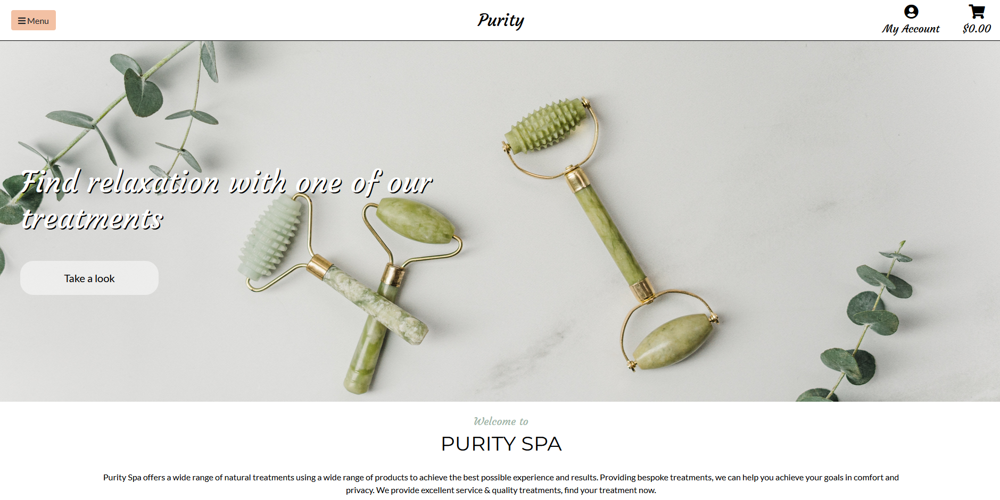
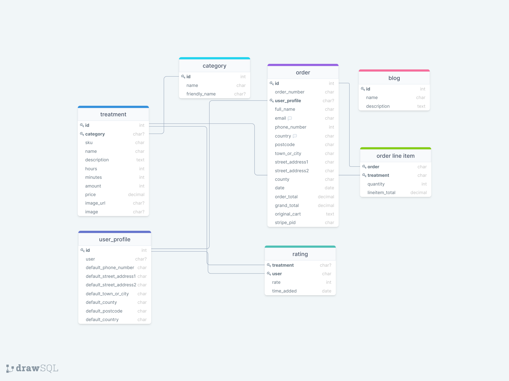

# Purity - Spa Website

### User Stories
|      As a/an...      |                         I want the ability to...                         |                        So that I can...                       |
|:--------------------:|:------------------------------------------------------------------------:|:-------------------------------------------------------------:|
|                      |                                                                          |                                                               |
|          ---         |                                    ---                                   |                              ---                              |
| Anonymous user       | view the site on all screen sizes;                                       | visit the site using my mobile and/or tablet device           |
| Anonymous user       | Understand what the site is about from landing page;                     | to make sure the website fits my needs                        |
| Anonymous user       | easily navigate around the site;                                         | find what I am looking for quickly and easily                 |
| Anonymous user       | search for treatments;                                                   | browse for treatments instead of scrolling through them all   |
| Anonymous user       | filter my search results;                                                | see the range of prices and categorys                         |
| Anonymous user       | read details about the treatments;                                       | to understand what the treatment provides                     |    
| Anonymous user       | add treatments into my cart;                                             | add a treatment whilst looking at more                        |
| Anonymous user       | understand why I should sign up;                                         | understand the benefits of signing up                         |
| Anonymous user       | gain access to the companys social media;                                | visit you social media pages                                  |
| Anonymous user       | register for a user profile account by choosing a username and password; | save billing details and gain access to offers, ratings       | 
|          ---         |                                    ---                                   |                              ---                              |
| Registered user      | log in and log out of my account;                                        | safeguard all my information whilst not active on the site    |
| Registered user      | update my billing information;                                           | update any new details I obtain                               |
| Registered user      | store my order history and check previous order receipts;                 | gain access to previous treatment orders                     |
| Registered user      | add rating to orders I purchased;                                        | so I can give the treatment a rating depending on what I thought of it|
|          ---         |                                    ---                                   |                              ---                              |
| Site admin/superuser | add new treatments to the site;                                          | always make new treatments avaliable for users                |
| Site admin/superuser | add blogs to the site;                                                   | update users on any new updates with the company              |
| Site admin/superuser | delete treatments;                                                       | delete treatments that are no longer provided                 |
| Site admin/superuser | edit treatment;                                                          | make changes to any added treatments                          |
| Site admin/superuser | delete blogs;                                                            | delete any updates that may not be needed anymore             |
| Site admin/superuser | edit blogs;                                                              | edit blogs for any mistakes/changes on the updates            |
|                      |                                                                          |                                                               |

## UX

### Project Goals
* Ease of use.
* Look at the stores treatments.
* Be able to purchase treatments in a simple process.
* Full authentication functionality.
* CRUD functionality for store owners to add blogs & treatments.
* Users who purchase a treatment, be able to set a rating.

### Scope
* Allow users to make purchases on the site.
* Allow users to set ratings on treatments they have purchased.
* Allow users to register for an account & change password when needed.
* Allow admins to use CRUD functionality to add treatments & blogs.
* Create the site using FullStack development skills.

### Structure
* Fixed navigation bar, this will increase UI/UX for all users on a wide range of devices. For example, small screens can easily navigate from anywhere in the page.
* The navigation bar will contain a dropdown menu containing page links and the website title. Also located in the navigation bar will be a profile dropdown containing login/signup or profile for logged in users, admins will have a link to add a treatment or blog. The final link in the navbar will be a link to the cart also showing the cart total.
* The top right just below the navbar will show all toast messages.
* Every page will contain a footer which will consist of the company address, links, contact details and social media links.

### Surface
#### Colours
I have chosen a wide range of colours for my website:
* #9eb4a7 This light shade of green was used to give a calm and relaxing feeling to the site. It was used mainly on buttons and on some backgrounds making the text stand out more.
* #f3c1a4 A mix of orange and beige complementing the overall theme of the site, this was mainly used on buttons and background colours.
* White was used alot over the site giving it a clean and calm feel in-line with the sites goals. White was mainly used on backgrounds and used on some text when on a darker background.
* Black was used for text to make it stand out on lighter backgrounds and catch the users eye.
* Any other colours were chosen throughout development, a case of this was when previously chosen colours and text did not stand out enough, so the colour was changed to match this.
#### Icons
In the project, icons were obtained from [Font Awesome](https://fontawesome.com/). Icons were used for different settings, for example they was used for social media icons but also to help users understand details. An example of this is the checkout button showing a locked lock to give the feel this is the final step before payment is taken.
#### Typography
* "Lato" used as a base font as it is readable and simple.
* "Dancing Script" An elegant font fitting the clean and fancy theme, mainly used for headings.
* "Courgette" Also an elegant font fitting the clean and fancy theme, mainly used for headings.
* "Monstratt" Used alongside "Lato" it is a clean and readble font perfect for getting information to the user.
#### Imagery
When choosing imagery I used [Pexels](https://www.pexels.com/). Images were mainly used as background images in the site as well as a fallback images if user's/admin uploaded image is not avaliable.

### Information Architecture
#### Database
SQLite3 was used during development which is included in the default Django installation. Heroku Postgres is used in the production site.

##### Blog App
###### blog model
|      Name            |     Key            |          Type        |         Validation             |
|:--------------------:|:------------------:|:--------------------:|:------------------------------:|
|                      |                    |                      |                                |
|       ---            |    ---             |        ---           |    ---                         |
| name                 | name               |  models.CharField    | max_length=254                 |
| description          | description        |  models.TextField    |                                |  
#### Checkout App
###### order model
|      Name            |     Key            |          Type        |         Validation                              |
|:--------------------:|:------------------:|:--------------------:|:-----------------------------------------------:|
|                      |                    |                      |                                                 |
|       ---            |    ---             |       ---            |    ---                                          |
| order number         | order_number       |  models.CharField    | max_length=32, null=False, editable=False       |
| user profile         | user_profile       |  models.ForeignKey   | UserProfile, on_delete=models.SET_NULL, null=True, blank=True, related_name='orders'|
| full name            | full_name          |  models.CharField    | max_length=50, null=False, blank=False          |
| email                | email              |  models.EmailField   | max_length=254, null=False, blank=False         |
| phone number         | phone_number       |  models.IntegerField | null=False, blank=False                         |
| country              | country            |  CountryField        | blank_label='Country *', null=False, blank=False|
| postcode             | postcode           |  models.CharField    | max_length=20, null=True, blank=True            |
| town or city         | town_or_city       |  models.CharField    | max_length=40, null=False, blank=False          | 
| street_address1      | street_address1    |  models.CharField    | max_length=80, null=False, blank=False          | 
| street_address2      | street_address2    |  models.CharField    | max_length=80, null=False, blank=False          | 
| county               | county             |  models.CharField    | max_length=80, null=True, blank=True            | 
| date                 | date               |  models.DateTimeField| auto_now_add=True                               | 
| order total          | order_total        |  models.DecimalField | max_digits=10, decimal_places=2, null=False, default=0|
| grand total          | grand_total        |  models.DecimalField | max_digits=10, decimal_places=2, null=False, default=0| 
| original cart        | original_cart      |  models.TextField    | null=False, blank=False, default=''             | 
| stripe pid           | stripe_pid         |  models.CharField    | max_length=254 ,null=False, blank=False, default=''|  
###### orderlineitem model
|      Name            |     Key            |          Type        |         Validation                              |
|:--------------------:|:------------------:|:--------------------:|:-----------------------------------------------:|
|                      |                    |                      |                                                 |
|       ---            |    ---             |           ---        |    ---                                          |
| order                | order              |  models.ForeignKey   | (Order, null=False, blank=False, on_delete=models.CASCADE, related_name='lineitems'|
| treatment            | treatment          |  models.ForeignKey   | Treatment, null=False, blank=False, on_delete=models.CASCADE|
| quantity             | quantity           |  models.IntegerField | null=False, blank=False, default=0                          |
| lineitem_total       | lineitem_total     |  models.DecimalField | max_digits=6, decimal_places=2, null=False, blank=False     |
##### Profiles App
###### userprofile model
|      Name            |     Key                |          Type        |         Validation                              |
|:--------------------:|:----------------------:|:--------------------:|:-----------------------------------------------:|
|                      |                        |                      |                                                 |
|       ---            |    ---                 |          ---         |    ---                                          |
| user                 | user                   |  models.OneToOneField| User, on_delete=models.CASCADE                  |
| phone number         | default_phone_number   |  models.CharField    | max_length=20, null=True, blank=True            |
| street_address1      | default_street_address1|  models.CharField    | max_length=80, null=True, blank=True            |
| street_address2      | default_street_address2|  models.CharField    | max_length=80, null=True, blank=True            |
| town or city         | default_town_or_city   |  models.CharField    | max_length=40, null=True, blank=True            |
| county               | default_county         |  models.CharField    | max_length=80, null=True, blank=True            |
| postcode             | default_postcode       |  models.CharField    | max_length=20, null=True, blank=True            |
| country              | default_country        |  CountryField        | blank_label='Country', null=True, blank=True    |
##### Treatments App
###### category model
|      Name            |     Key                |          Type        |         Validation                   |
|:--------------------:|:----------------------:|:--------------------:|:------------------------------------:|
|                      |                        |                      |                                      |
|       ---            |    ---                 |          ---         |    ---                               |
| name                 | name                   |  models.CharField    | max_length=254                       |
| friendly name        | friendly_name          |  models.CharField    | max_length=254, null=True, blank=True|
###### treatment model
|      Name            |     Key                |          Type        |         Validation                              |
|:--------------------:|:----------------------:|:--------------------:|:-----------------------------------------------:|
|                      |                        |                      |                                                 |
|       ---            |    ---                 |          ---         |    ---                                          |
| category             | category               |  models.ForeignKey   | 'Category', null=True, blank=True, on_delete=models.SET_NULL|
| sku                  | sku                    |  models.CharField    | max_length=12                                   |
| name                 | name                   |  models.CharField    | max_length=50                                   |
| description          | description            |  models.TextField    | max_length=200                                  |
| hours                | hours                  |  models.IntegerField | default=0                                       |
| minutes              | minutes                |  models.IntegerField | default=0                                       |
| amount               | amount                 |  models.IntegerField | default=1                                       |
| price                | price                  |  models.DecimalField | max_digits=6, decimal_places=2                  |
| image url            | image_url              |  models.URLField     | max_length=1024, null=True, blank=True          |
| image                | image                  |  models.ImageField   | null=True, blank=True                           |
###### rating model
|      Name            |     Key                |          Type                    |         Validation                              |
|:--------------------:|:----------------------:|:--------------------------------:|:-----------------------------------------------:|
|                      |                        |                                  |                                                 |
|       ---            |    ---                 |          ---                     |    ---                                          |
| treatment            | treatment              |  models.ForeignKey               | Treatment, on_delete=models.CASCADE, null=True  |
| user                 | user                   |  models.ForeignKey               | User, on_delete=models.CASCADE, null=True       |
| rate                 | rate                   |  models.PositiveSmallIntegerField| choices=RATE_CHOICES, default=3                 |
| time_added           | time_added             |  models.DateTimeField            | default=timezone.now                            |

#### Wireframes
* Wireframes do not contain tablet wireframe due to the simular style as large & small screens, the only differences may be some slight position movement. Any differences from the wireframes and depolyed site where choices made along the way to better suite the site design.
* [Wireframes](documents/wireframe/spa-wireframe.pdf).

## Features
### Existing Features
* Created with HTML5, CSS3, JavaScript, jQuery, Bootstrap, Django, Python.
* Responsive design.
###### Home Page
A simple and clean landing page, showing what the website provides, link to the treatments and a contact detail area.
[Home Page Screenshot](documents/image-features/homepage-features.png)
###### Treatments Page
A page showing all treatments on the site, the page provides sorting options, treatment category links, ability for the user to click on the treatment to view its details and also for admin users a button to add treatments to the site.
[Treatments Page Screenshot](documents/image-features/treatmentspage-features.png)
###### Treatment Details Page
This page provides all details about the treatment, and a image representing the type of treatment. Also on the site is the treatments average rating where only users who have purchased the treatment can add a rating. For admin users an edit and delete button are provided.
[Treatment Details Page Screenshot](documents/image-features/treatmentdetailspage-features.png)
###### Cart Page
A page where all treatments a user has added are, showing the name, sku, price, quantity with the ability to update the quantity, for (amount of people its for) and the total of that line item. There is also a grand total which works out all the items cost, below is a link to the terms of service and below that is a link to the checkout page.
[Cart Page Screenshot](documents/image-features/cartpage-features.png)
###### Checkout Page
Checkout page shows the list of all items in the cart, the price of them all and a billing details form, once filled out correctly you can choose to adjust cart or complete order. Choosing complete order will take payment and take you to a success page showing a receipt of your purchase.
[Checkout Page Screenshot](documents/image-features/checkoutpage-features.png)
###### Blog Page
A page showing all blogs that store owners have added, blogs can range from updates, to information about subjects.
[Blog Page Screenshot](documents/image-features/blogpage-features.png)
###### Blog Details Page
A page that shows the blog text for a user to read, this page also contains a back to blogs button and a edit/delete button for admin users only.
[Treatment Details Page Screenshot](documents/image-features/blogdetailspage-features.png)
###### Profile Page
The profile page shows all order history which are clickable to see previous order receipts, default billing information that can be changed and a change password button for users to update their password.
[Profile Page Screenshot](documents/image-features/profilepage-features.png)
###### Add Treatment Management Page
A page for admin users to add treatments to the site.
[Add Treatment Page Screenshot](documents/image-features/addtreatmentpage-features.png)
###### Edit Treatment Page
A page for admin users to edit treatments on the site.
[Edit Treatment Page Screenshot](documents/image-features/edittreatmentpage.png)
###### Add Blog Page
A page for admin users to add blogs to the site.
[Add Blog Page Screenshot](documents/image-features/addblogpage-features.png)
###### Edit Blog Page
A page for admin users to edit blogs on the site.
[Edit Blog Page Screenshot](documents/image-features/editblogspage.png)
###### Add Rating page
A page for users who have purchased the treatment, to set a rating.
[Add Rating Page Screenshot](documents/image-features/addratingpage-features.png)

### Features Left To Implement
* A future feature I would like to implement would be a discount feature where admin users can run offers on treatments.
* A future feature I would like to implement would be a booking system, so users can book a date and time for their treatment.

## Technologies Used
* HTML5
* CSS3
* JavaScript
* Python
* Bootstrap
* FontAwesome
* Google Fonts
* jQuery
* Django
* Git
* Heroku 
* GitHub
* AWS S3 bucket

## Testing
Purity was tested throughout making bug fixes along the way as shown in my commits.
The full testing process can be found [here](documents/testing.md).

## Deployment
[Deployment MD](documents/deployment.md)

## Resources
* Stack Overflow
* [Code Institute Course](https://codeinstitute.net/)
* YouTube
* Balsamiq Wireframes
* Am I Responsive
* TinyPNG

## Credits
[Bootstrap](https://getbootstrap.com/)
[Card designs](https://freefrontend.com/bootstrap-cards/)
[Code Insitute Walk Through Project](https://codeinstitute.net/)
### Media
* [Pexels](https://www.pexels.com/) was used for imagery.
### Acknowledgements
* Mentor Precious Ijege for his support and knowledge.
* Tutor support at Code Institute for their assistance.
* Slack community for assistance and questions.
* Code Insitute course content.
### Support
For any queries or support contact jack200034@hotmail.com